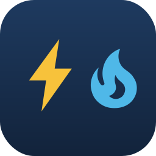

# Avista Utilities for Home Assistant

Pulls electric and gas usage and cost from [Avista](https://www.myavista.com) into
Home Assistant's Energy dashboard, via the [bidgely](https://github.com/nick-bogle/bidgely)
library.

Avista publishes usage roughly a day late, so this integration writes **long term
statistics** rather than live sensors. It creates no entities; the data appears in
the Energy dashboard and in Developer Tools -> Statistics.

## Installation

### Via HACS

That button opens this repository in HACS on your own Home Assistant. Otherwise
add it by hand: HACS -> Integrations -> the three dot menu -> **Custom
repositories** -> `https://github.com/nick-bogle/ha-avista`, category
**Integration**.

Then **Download**, and restart Home Assistant.

### By hand

Copy `custom_components/avista/` into your `config/custom_components/` and
restart Home Assistant.

### Then add the integration

Or: Settings -> Devices & Services -> Add Integration -> **Avista Utilities**.
Sign in with your myavista.com email and password.

Electric and gas are detected automatically: the setup probes each fuel and enables
whichever the account actually has service for.

The first run takes roughly 45 seconds while it backfills history, so expect a
"setup is taking over 10 seconds" warning in the log.

## Energy dashboard

Settings -> Energy, then add:

| Source | Statistic |
|---|---|
| Electricity grid consumption | `Avista electric consumption` |
| ... with cost | `Avista electric cost` |
| Gas consumption | `Avista gas consumption` |
| ... with cost | `Avista gas cost` |

## Known caveat: gas is reported in therms, labelled CCF

**Avista meters gas in therms. Home Assistant has no therm unit**, so the gas
statistic is labelled `CCF` (hundred cubic feet) — the same unit the `opower`
integration uses for gas.

The therm values are passed through **unconverted**. Therms measure energy and CCF
measures volume; converting between them requires the gas heat content, which the
Avista API never returns. Any conversion factor would be a guess that corrupts the
numbers, so the numbers you see match your bill exactly and only the unit label is
wrong (1 CCF is roughly 1.037 therms, so treat the label as nominal).

Costs are unaffected — they come straight from the API in dollars.

## Notes

- **No bill forecast.** Avista's Bidgely host puts `/2.1/*` (`billprojections`)
  behind AWS IAM auth and rejects bearer tokens, so no forecast is available.
- **Two read resolutions.** Avista answers a usage request in about 4 seconds,
  and hourly data costs one request per *day*, so an hourly backfill of real
  history cannot finish inside Home Assistant's 300 second setup timeout. The
  last 14 days are read hourly; everything older comes from daily reads, which
  cover 32 days per request. First run takes roughly 45 seconds for both fuels,
  so expect a "setup is taking over 10 seconds" warning in the log. Later
  refreshes run every 12 hours and re-read the last 30 days to pick up utility
  corrections.
- **The first partial bill cycle has no hourly or daily data.** Avista's
  per-day data starts later than its billing data, so the opening partial cycle
  exists only at monthly resolution and is not imported. It is a one-off gap of
  a few days at the very beginning of history.
- **Statistic IDs** are keyed by the Bidgely user id, because Avista's
  `getBidgelyWidgetData` returns whichever account the session has active — the
  account number is never sent.

## Requirements

Home Assistant 2026.2.3 or newer — verified against that version. The statistics
metadata this writes uses `mean_type`/`unit_class`, which replaced the `has_mean`
field removed in 2026.4.

The integration icon in `custom_components/avista/brand/` needs Home Assistant
2026.3.0 or newer, which is when custom integrations gained the ability to ship
their own brand images. On older versions everything still works, you just get
the default placeholder icon.

The icon is a generic bolt-and-flame mark for electric and gas. It is
deliberately **not** Avista's logo: inventing something Avista-looking would
misrepresent their branding, and their real logo is theirs to decide about.
